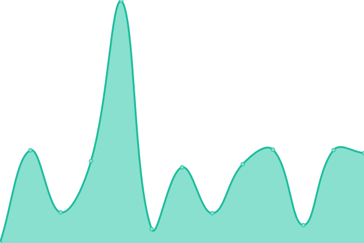

# [📈 Live Status](https://matheusot.github.io/upptime-monitor): <!--live status--> **🟧 Partial outage**

This repository contains the open-source uptime monitor and status page for [Matheus Rodrigues](https://matheusot.github.io/upptime-monitor), powered by [Upptime](https://github.com/upptime/upptime).

With [Upptime](https://upptime.js.org), you can get your own unlimited and free uptime monitor and status page, powered entirely by a GitHub repository. We use [Issues](https://github.com/matheusot/upptime-monitor/issues) as incident reports, [Actions](https://github.com/matheusot/upptime-monitor/actions) as uptime monitors, and [Pages](https://matheusot.github.io/upptime-monitor) for the status page.

<!--start: status pages-->
<!-- This summary is generated by Upptime (https://github.com/upptime/upptime) -->
<!-- Do not edit this manually, your changes will be overwritten -->
<!-- prettier-ignore -->
| URL | Status | History | Response Time | Uptime |
| --- | ------ | ------- | ------------- | ------ |
|  [Atis Cleaning](https://atiscleaning.com) | 🟥 Down | [atis-cleaning.yml](https://github.com/matheusot/upptime-monitor/commits/HEAD/history/atis-cleaning.yml) | 

 277ms
     
 | 

<a href="https://matheusot.github.io/upptime-monitor/history/atis-cleaning">90.34%</a>
    

|  [Atis Consults](https://atisconsults.com) | 🟥 Down | [atis-consults.yml](https://github.com/matheusot/upptime-monitor/commits/HEAD/history/atis-consults.yml) | 

 640ms
     
 | 

<a href="https://matheusot.github.io/upptime-monitor/history/atis-consults">89.27%</a>
    

|  [Connect Notice](https://connectnotice.com) | 🟥 Down | [connect-notice.yml](https://github.com/matheusot/upptime-monitor/commits/HEAD/history/connect-notice.yml) | 

 753ms
     
 | 

<a href="https://matheusot.github.io/upptime-monitor/history/connect-notice">0.00%</a>
    

|  [Local Locksmith Sandy](https://locallocksmithsandy.com) | 🟥 Down | [local-locksmith-sandy.yml](https://github.com/matheusot/upptime-monitor/commits/HEAD/history/local-locksmith-sandy.yml) | 

 248ms
     
 | 

<a href="https://matheusot.github.io/upptime-monitor/history/local-locksmith-sandy">90.34%</a>
    

|  [LockTheSmith](https://lockthesmith.com) | 🟥 Down | [lock-the-smith.yml](https://github.com/matheusot/upptime-monitor/commits/HEAD/history/lock-the-smith.yml) | 

 702ms
     
 | 

<a href="https://matheusot.github.io/upptime-monitor/history/lock-the-smith">87.60%</a>
    

|  [LockTheSmith UT](https://lockthesmithut.com) | 🟥 Down | [lock-the-smith-ut.yml](https://github.com/matheusot/upptime-monitor/commits/HEAD/history/lock-the-smith-ut.yml) | 

 132ms
     
 | 

<a href="https://matheusot.github.io/upptime-monitor/history/lock-the-smith-ut">87.66%</a>
    

|  [PGrove Locksmith](https://pgrovelocksmith.com) | 🟥 Down | [p-grove-locksmith.yml](https://github.com/matheusot/upptime-monitor/commits/HEAD/history/p-grove-locksmith.yml) | 

 624ms
     
 | 

<a href="https://matheusot.github.io/upptime-monitor/history/p-grove-locksmith">88.48%</a>
    

|  [Marcos Locksmith](https://marcoslocksmithservice.com) | 🟥 Down | [marcos-locksmith.yml](https://github.com/matheusot/upptime-monitor/commits/HEAD/history/marcos-locksmith.yml) | 

 257ms
     
 | 

<a href="https://matheusot.github.io/upptime-monitor/history/marcos-locksmith">90.43%</a>
    

|  [Matheus Rodrigues](https://matheusrodrigues.com.br) | 🟥 Down | [matheus-rodrigues.yml](https://github.com/matheusot/upptime-monitor/commits/HEAD/history/matheus-rodrigues.yml) | 

 344ms
     
 | 

<a href="https://matheusot.github.io/upptime-monitor/history/matheus-rodrigues">90.43%</a>
    

|  [Sandy Local Locksmith](https://locallocksmithsandy.com) | 🟥 Down | [sandy-local-locksmith.yml](https://github.com/matheusot/upptime-monitor/commits/HEAD/history/sandy-local-locksmith.yml) | 

 170ms
     
 | 

<a href="https://matheusot.github.io/upptime-monitor/history/sandy-local-locksmith">90.42%</a>
    

|  [Terry Ironwood](https://terryironwood.com) | 🟥 Down | [terry-ironwood.yml](https://github.com/matheusot/upptime-monitor/commits/HEAD/history/terry-ironwood.yml) | 

 243ms
     
 | 

<a href="https://matheusot.github.io/upptime-monitor/history/terry-ironwood">89.36%</a>
    

|  [Tim The Safecracker](https://timthesafecracker.com) | 🟥 Down | [tim-the-safecracker.yml](https://github.com/matheusot/upptime-monitor/commits/HEAD/history/tim-the-safecracker.yml) | 

 232ms
     
 | 

<a href="https://matheusot.github.io/upptime-monitor/history/tim-the-safecracker">90.42%</a>
    

|  [Wevelop](https://wevelop.com.br) | 🟥 Down | [wevelop.yml](https://github.com/matheusot/upptime-monitor/commits/HEAD/history/wevelop.yml) | 

 407ms
     
 | 

<a href="https://matheusot.github.io/upptime-monitor/history/wevelop">90.42%</a>
    

|  [Wvlp](https://wvlp.com.br) | 🟩 Up | [wvlp.yml](https://github.com/matheusot/upptime-monitor/commits/HEAD/history/wvlp.yml) | 

 356ms
     
 | 

<a href="https://matheusot.github.io/upptime-monitor/history/wvlp">100.00%</a>
    

|  [Miazi Media](https://miazimedia.com) | 🟥 Down | [miazi-media.yml](https://github.com/matheusot/upptime-monitor/commits/HEAD/history/miazi-media.yml) | 

 216ms
     
 | 

<a href="https://matheusot.github.io/upptime-monitor/history/miazi-media">90.42%</a>
    

|  [The Papa High](https://thepapahigh.com) | 🟥 Down | [the-papa-high.yml](https://github.com/matheusot/upptime-monitor/commits/HEAD/history/the-papa-high.yml) | 

 306ms
     
 | 

<a href="https://matheusot.github.io/upptime-monitor/history/the-papa-high">90.41%</a>
    

|  [Viamerica](https://viamerica.com.br) | 🟥 Down | [viamerica.yml](https://github.com/matheusot/upptime-monitor/commits/HEAD/history/viamerica.yml) | 

 1124ms
     
 | 

<a href="https://matheusot.github.io/upptime-monitor/history/viamerica">90.41%</a>
    

|  [ViaMiazi](https://viamiazi.com) | 🟥 Down | [via-miazi.yml](https://github.com/matheusot/upptime-monitor/commits/HEAD/history/via-miazi.yml) | 

 286ms
     
 | 

<a href="https://matheusot.github.io/upptime-monitor/history/via-miazi">90.41%</a>
    

|  [n8n wvlp](https://n8n.wvlp.com.br) | 🟩 Up | [n8n-wvlp.yml](https://github.com/matheusot/upptime-monitor/commits/HEAD/history/n8n-wvlp.yml) | 

 346ms
     
 | 

<a href="https://matheusot.github.io/upptime-monitor/history/n8n-wvlp">100.00%</a>
    

<!--end: status pages-->

[**Visit our status website →**](https://matheusot.github.io/upptime-monitor)

## 📄 License

- Powered by: [Upptime](https://github.com/upptime/upptime)
- Code: [MIT](./LICENSE) © [Anand Chowdhary](https://anandchowdhary.com), supported by [Pabio](https://pabio.com)
- Data in the `./history` directory: [Open Database License](https://opendatacommons.org/licenses/odbl/1-0/)
