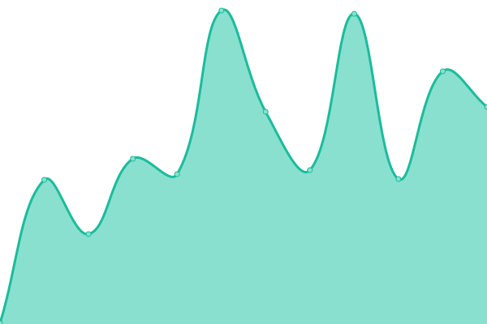

# [📈 Live Status](https://matheusot.github.io/upptime-monitor): <!--live status--> **🟧 Partial outage**

This repository contains the open-source uptime monitor and status page for [Matheus Rodrigues](https://matheusot.github.io/upptime-monitor), powered by [Upptime](https://github.com/upptime/upptime).

With [Upptime](https://upptime.js.org), you can get your own unlimited and free uptime monitor and status page, powered entirely by a GitHub repository. We use [Issues](https://github.com/matheusot/upptime-monitor/issues) as incident reports, [Actions](https://github.com/matheusot/upptime-monitor/actions) as uptime monitors, and [Pages](https://matheusot.github.io/upptime-monitor) for the status page.

<!--start: status pages-->
<!-- This summary is generated by Upptime (https://github.com/upptime/upptime) -->
<!-- Do not edit this manually, your changes will be overwritten -->
<!-- prettier-ignore -->
| URL | Status | History | Response Time | Uptime |
| --- | ------ | ------- | ------------- | ------ |
|  [LockTheSmith](https://lockthesmith.com) | 🟩 Up | [lock-the-smith.yml](https://github.com/matheusot/upptime-monitor/commits/HEAD/history/lock-the-smith.yml) | 

 806ms
     
 | 

<a href="https://matheusot.github.io/upptime-monitor/history/lock-the-smith">99.80%</a>
    

|  [LockTheSmith UT](https://lockthesmithut.com) | 🟩 Up | [lock-the-smith-ut.yml](https://github.com/matheusot/upptime-monitor/commits/HEAD/history/lock-the-smith-ut.yml) | 

 720ms
     
 | 

<a href="https://matheusot.github.io/upptime-monitor/history/lock-the-smith-ut">99.81%</a>
    

|  [Terry Ironwood](https://terryironwood.com) | 🟩 Up | [terry-ironwood.yml](https://github.com/matheusot/upptime-monitor/commits/HEAD/history/terry-ironwood.yml) | 

 228ms
     
 | 

<a href="https://matheusot.github.io/upptime-monitor/history/terry-ironwood">100.00%</a>
    

|  [Wevelop](https://wevelop.com.br) | 🟥 Down | [wevelop.yml](https://github.com/matheusot/upptime-monitor/commits/HEAD/history/wevelop.yml) | 

 534ms
     
 | 

<a href="https://matheusot.github.io/upptime-monitor/history/wevelop">0.00%</a>
    

|  [Connect Notice](https://connectnotice.com) | 🟥 Down | [connect-notice.yml](https://github.com/matheusot/upptime-monitor/commits/HEAD/history/connect-notice.yml) | 

 1969ms
     
 | 

<a href="https://matheusot.github.io/upptime-monitor/history/connect-notice">100.00%</a>
    

|  [Viamerica](https://viamerica.com.br) | 🟩 Up | [viamerica.yml](https://github.com/matheusot/upptime-monitor/commits/HEAD/history/viamerica.yml) | 

 346ms
     
 | 

<a href="https://matheusot.github.io/upptime-monitor/history/viamerica">100.00%</a>
    

|  [PapaHigh](https://thepapahigh.com) | 🟩 Up | [papa-high.yml](https://github.com/matheusot/upptime-monitor/commits/HEAD/history/papa-high.yml) | 

 258ms
     
 | 

<a href="https://matheusot.github.io/upptime-monitor/history/papa-high">100.00%</a>
    

<!--end: status pages-->

[**Visit our status website →**](https://matheusot.github.io/upptime-monitor)

## 📄 License

- Powered by: [Upptime](https://github.com/upptime/upptime)
- Code: [MIT](./LICENSE) © [Anand Chowdhary](https://anandchowdhary.com), supported by [Pabio](https://pabio.com)
- Data in the `./history` directory: [Open Database License](https://opendatacommons.org/licenses/odbl/1-0/)
